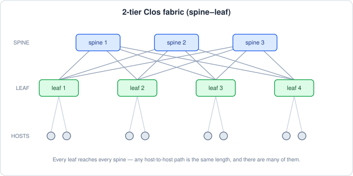

I was reading the second edition of *Designing Data-Intensive Applications* and
hit a short section comparing cloud computing to supercomputing. Clouds run on
Ethernet and IP arranged in Clos topologies. Supercomputers use RDMA and weird
topologies like 3D toruses. It reminded me of something I'd half-wondered about
at work: AWS has this thing called Elastic Fabric Adapter for HPC workloads, so
what's NVIDIA's equivalent? The short answer is "InfiniBand, roughly." It's
correct and it taught me nothing.

The better question turned out to be why AWS built its own weird not-quite-RDMA
networking stack when InfiniBand already existed. I kept asking why, and each
answer opened up another layer: kernel bypass, why microseconds matter in some
systems and not others, why one slow GPU can stall four thousand others, and why
AWS decided tail latency mattered more than best-case latency. By the end, the
cloud vs. supercomputer distinction I'd just read in DDIA didn't really hold
anymore. The hyperscalers have spent the last few years building supercomputers
inside their clouds.

None of this is secret. It's all in AWS papers, NVIDIA docs, and conference
talks. But nobody hands you the map, and every explanation I found assumed I
already understood three other things. So the next post is my attempt at the
map: EFA vs. InfiniBand vs. Ethernet, what a Clos network actually is, AllReduce
as the reason any of it matters, and why a book from 2017 ended up wrong in an
interesting way. Not because Kleppmann made a mistake, but because the workloads
changed.
